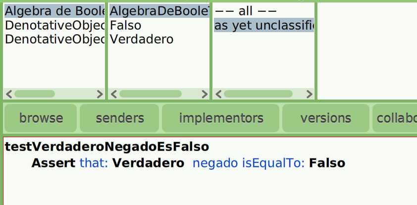
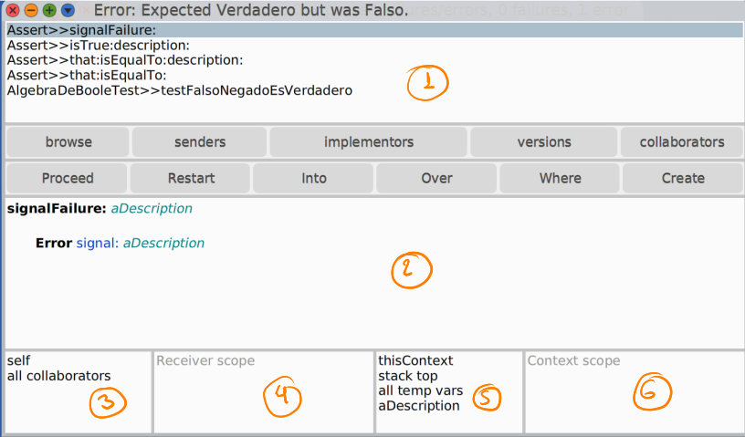
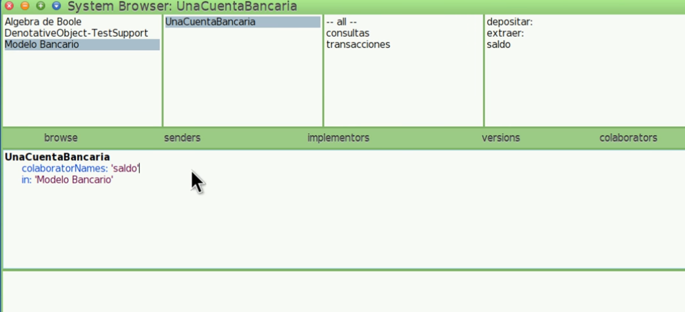
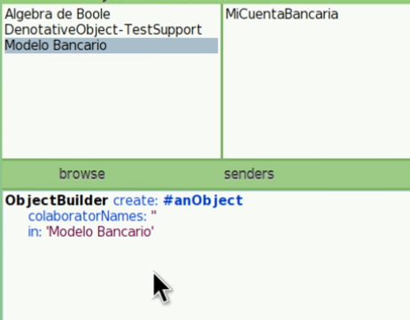

# Cuis University

Este es un ambiente creado especialmente para la enseñanza de la Programación Orientada a Objetos, usando Smalltalk como herramienta y en particular la implementación Argentina de Smalltalk denominada Cuis.

## Instalación

1. Primero descarga el Cuis -> [Download](https://sites.google.com/view/cuis-university/descargas?authuser=0)

2. Dentro de la carpeta **linux64** (donde se encuentra todos los archivos) podrán encontrar un archivo llamado `run.sh` -> Abrir una terminal y ejecutar `./run.sh` y LISTO!

## Introducción al Browser

### Browser de Objetos
En esta materia vamos a trabajar con el **DenotativeObject Browser** dentro del CUIS. Parar abrirlo solo debes hacer click derecho en la pantalla azul ->  click `DenotativeObject Browser` y listo! Ahora veamos el browser:


* (1) Indica las distintas categorias de Objetos que tengo en mi categoria
* (2) Podemos ver los objetos de la categoria seleccionada en (1)
* (3) me muestra el conjunto de categorias de los mensajes que puede responder un objeto
* (4) Mensajes de las categorias en (3)
* (5) Podemos ver como esta implementado un mensaje de (4)
* (6) Workspace: aquí podemos escribir **colaboraciones** e implementarlas por ejemplo:
    - Escribo 1+2
    - Click derecho y escojo `print it (p)` -> me devuelve 3


### Creación de Objetos

Para crear un objeto vamos a implementar el '*Algebra de Boole*' (Verdadero y Falso) como ejemplo. Vamos a estar utilizando este ejemplo a lo largo del tutorial.

1. En (2) hacemos click derecho y apreto en `add object in category`
    - Me pregunta el nombre del obejto que quiero crear -> **Verdadero**
    - Luego categorizo este objeto como *Algebra de Boole*

Hasta el momento este objeto no sabe responder ningún mensaje. Asi que veremos como hacer que responda a alguno, pero antes de continuar veamos como guardar estos cambios para no perder nuestro progreso.

---
**<span style="color:#ED3207">Grabar Imagen</span>**\
Para guardar estos nuevos cambios que vamos realizando debemos:
1. Volver al menú principal o inicio (pantalla azul)
2. Click derecho -> `save`
Y asi queda guardada nuestra ultima versión de la imagen.

También podemos **grabar la imagen con otro nombre**, esto con `save as`. Esto me permite clonar imagenes y guardar distinta versiones del mismo.


Para **recuperar una imagen** (Solo la ultima versión guardada): Click derecho -> Quit -> No -> Yes.

---

### Implementación de mensajes

1. Seleccionamos el objeto -> **Verdadero** (2)
2. Elegimos la categoria en la cual queremos poner el mensaje (en este caso) -> `as get unclassified` (3)
3. En (5) podemos implementar nuestro mensaje:\
    
4. Click derecho -> accept(s) o `[alt + s]`
    - Como Falso es un obejto que aún no creamos entonces hago click en `define new denotative object`

OBS: en (2) aparece **Falso** como un nuevo objeto.


**VERIFICACIÓN**
En (6) escribimos la siguiente colaboración: **`Verdadero negado`**\
Luego click derecho -> `print it (p)` o `[alt + p]` . Debe retornar **Falso**


Otra forma de ver el resultado es:\
- En (5) donde se encuentra nuestro mensaje implementado hacemos click derecho y apreto en **`Accept, Send and Inspect (e)`** esto nos dirigira al inpector del resultado (que es Falso)


### Tipos de mensajes
Existen 3 tipos de mensajes

1. **UNARIOS** : No reciben ningún tipo de colaborador. Por ejemplo `Falso negado`\
    


2. **BINARIOS**: el nombre es un *simbolo* y se espera un colaborador externodentro del mensaje. Ejemplo: `1+2` donde **1** es el obj. receptor, **+** el mensaje y **2** el colaborador.


3. **KEYWORD**: es un mensaje que espera más de un colaborador externo y esos colaboradores estan intercalados por distintos keywords. Ejemplo:\
    

> [!IMPORTANT]
> **¿En que orden se envian los mensajes?**\
> Se envian de **Izquierda a Derecha -> empezando** por los unarios, luego binarios y por último los keywords.

**OBS**-----------------------------------------------------------------------------------------------\
CUIDADO CON EL ORDEN. Si ejecutamos la siguiente cuenta matematica
```Smalltalk
1+2*3
esperado: 7
resultado: 9
```
**¿Qué paso?** Pues como vemos no hay ningún unario en esta cuenta. Pero si binarios, y como lee de izquierda a derecha el primer binario con el que se topa es 1+2 que es 3 y luego sigue con la cuenta 3*3 = 9.\
**¿Cómo lo correjimos?** Usando parentesis le decimos que esa cuenta debe atenderse primero. Entonces -> 1+(2*3).

---


**<ins>Implementación de mensajes KEYWORD</ins>**


Ahora implementaremos los mensajes lógicos tanto para Falso como Verdadero. Empecemos como ejemplo Verdadero.

```smalltalk
y: unBooleano
    ⬆unBooleano
```
Lo enviamos e inspeccionamos y veremos que nos pide un colaborador -> Verdadero o Falso. También podemos escribir en el workspace `Verdadero y: Falso`.


Continuar con los otros ;)


## Testing

### Creación Tests
Veamos como crear tests en el browser, de esta forma nos aseguramos que nuestra implementación sea correcta.

1. Creamos un objeto en (2) -> `add object...(a)` y lo llamamos `AlgebraDeBooleTest`
2. Al igual que en Falso y Verdadero vamos a implementar nuestros mensajes. Para que un test sea reconocio como tal es importante que el **nombre inicie con test**:\
    
3. Ejecutamos `accept and send` o `[alt + t]`

Y veremos que los tests corrieron con éxito! Veamos que sucede con el siguiente test:

```
testVerdaderoYFalsoEsFalso
    Assert that: Verdadero y: False isEqualTo Falso

Nos devuelve !error.
Esto se debe a que no sabe cual es el primer colaborador. Corregimos con (): 

testVerdaderoYFalsoEsFalso
    Assert that: (Verdadero y: False) isEqualTo Falso

```

> ![NOTE]
> No es necesario que los tests estén dentro de un objeto especial, también podemos crearlo en el mismo objeto donde trabajamos.
> Podemos correr todos los tests haciendo click derecho en la categoria (1), objeto (2) o categoria de mensajes (3) y apretar `run tests (t)`. O correr un test especifico con click derecho y `send (t)` en algun test (4).


### Debugger

¿Qué hacemos cuando un test falla?
Para verlo con más detalle vamos a modificar la implementación de `Falso negado` de la sig forma:
```
negado
    ⬆Falso    
```
Luego al correr los tests vemos nos devuelve una pantalla con ERROR. Luego al hacer OK aparece el debugger.\


* (1) se muestra una lista del conjunto de colaboraciones que se fueron enviando hasta el momento del error. Se **lee de Abajo hacia Arriba**.

* (2) Si seleccionamos una colaboración podremos ver aquí el ***método*** relacionado al mensaje que se envío es esa colaboración.

* (3) Es el inspector de quienes son los objetos receptores. Si apreto en `self` puedo ver en (4) el objeto receptor.


**restart** : reinicializa la ejecución de lo que estamos debuggeando a partir de la colaboración que tengamos seleccionada (1)


**into**: entra a la implementación del mensaje que se esta enviando. (Es como el pasito x pasito)


**over**: Envía la colaboración y para en la proxima colaboración correspondiente. (Pasa derecho al siguiente paso/función)


**proceed**: Continua con la ejecución (Se salta todo los pasos y pasa directo al resultado)


**OBS**-----------------------------------------------------------------------------------------------\
Desde el debugger podemos modificar la implementación de un método a medida que el método se va ejecutando.

---

## Browser (2da parte)

### Inspector
Nos permite acceder a un objeto y jugar con él. Para acceder al inspector de un objeto hacemos click derecho sobre el obejto -> `Inspect (i)`

### Colaboradores
Un objeto puede conocer otros objetos para llevar acabo sus actividades, estos "otros objetos" se los denomina **colaboradores**. Veamos el siguiente ejemplo de una cuenta bancaraia:\



**¿Cómo hacemos para agregar un colaborador?**\
Podemos hacer click derecho en el objeto `UnaCuentaBancaria` -> `add colaborator` ò tambien haciendo lo siguiente en el método:
```
UnaCuentaBancaria
    colaboratorNames: 'saldo FechaYHoraDeUltimaTransaccion'
    in: 'Modelo Bancario'
```

**NOTA**
- Podemos renombrar un colaborador: click derecho en el objeto -> `rename colaborator`
- Idem eliminar. Pero SII no se usa en ningún método


**TIPOS DE COLABORADORES**\
* **Internos**: pertenecen al objeto como `saldo`
* **externos**: Aquellos que recibo cuando me envian un mensaje
* **Temporales**: aquellos que necesito conocer solo durante la evaluación de un método.

Veamos un ejemplo:
```
depositar: unaCantidadDeDinero "esto es un colaborador externo"

    |colaborador1| "Esto es un colaborador temporal"

    colaborador1 := 1.
    balance ← balance + unaCantidadDeDinero
    ⬆balance
```

> [!WARNING]
> **¿Qué sucede si creamos un colaborador interno llamado *colaborador1*?** Por el momento nada, pero si llegaramos a usar ese *colaborador interno* en `depositar` no se tomaria en cuenta ya que se lo utiliza como un *colab. Temporal*.


### Senders e implementors

Podemos ver en el Browser unas pestañitas con estos nombres, ¿para qué sirven?.

* **Senders**: me muestra todos los lugares en donde un mensaje es enviado. \
    Por ejemplo el mensaje **negado** si clickeamos en su implementación y luego apretamos en senders podemos ver todos los luagres donde se envia este mensaje (en los tests)
* **Implementors**: me muestra todos los objetos que implementan un mensaje y cómo es su implementación. 
    Por ejemplo el mensaje **negado** es implementado por Falso y Verdadero.


Si hay muchos mensajes entonces senders me ofrecerá opciones para ver los sender de cada mensaje. Idem implementors.\
De la misma forma podemos ver los senders e implementors en el Debugger.

### Compartir un Modelo
Dentro del Browser.


**EXPORTAR**\
1. En la categoria que quiero compartir `Algebra de Boole` en (1)
2. Click en `fileOut` y guardar en la carpeta correspondiente. Esto genera un archivo .st en formato de texto que contiene todos los elementos de la categoria.


**IMPORTAR**\
1. Dentro del panel de categoria de obejtos (1) hago click derecho -> `fileIn`
2. escribo `Algebra#de#Boole.st` y listo!.


Otra forma de hacerlo (MAS FÁCIL) es arrastrar el archivo **`.st`** y lanzarlo en la categoria de objetos (1) -> `FileIn`.


### Herramientas adicionales para manipular Objetos

* **Clonar un Objeto**: si quisieramos utilizar las mismas funciones de un objeto pero con distintos datos, podemos clonar el mismo haciendo clik derecho sobre el objeto -> `clone...` y ponerle otro nombre


* **Múltiples Browser**: podemos trabajr con distintos browser al mismo tiempo, clik en la pestaña `browse`.


* **Agregar un obejto**: Podemos agregar un objeto en una categoria mediante una implementación. Hacemos click en la categoria correspondiente y veremos lo siguiente:\
\
    Si queremos agregar un nuevo objeto solo debemos escribir el nombre del obejto y si tiene algún colaborador agregarlo:

    ```
    ObjectBuilder create #LaCuentaBAncariaDeMiMujer
        colaboratorNAmes: 'saldo'
        in: 'Modelo Bancario'
    ```


    Guardamos (`accept (s)`) y Listo, objeto guardado!\
    **OBS**: no es necesario escribirlo en (5) tambien podemos escribirlo en nuestro workSpace (6). Un avez escrito en (6) seleccionamos la implementación -> click derecho -> `Do it (d)`


* **Renombrar colaborador**: si queremos renombrar un colab. externo o temporal solo debemos seleccionarlo en el método -> click derecho -> **`Rename temporary`** y accept!. Esto cambiara el nombre de todas las colaboraciones con el nombre viejo.


