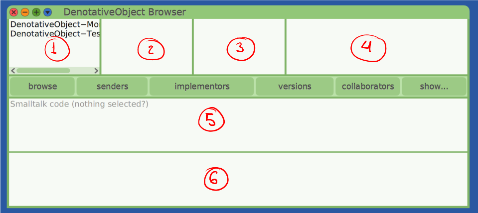
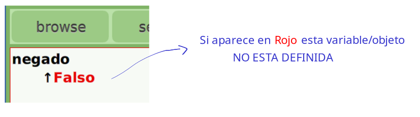
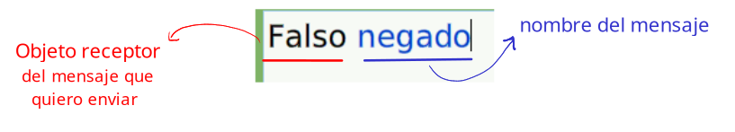
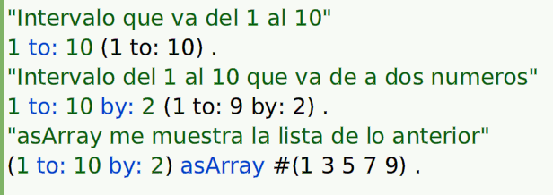

# Cuis University

Este es un ambiente creado especialmente para la enseñanza de la Programación Orientada a Objetos, usando Smalltalk como herramienta y en particular la implementación Argentina de Smalltalk denominada Cuis.

## Instalación

1. Primero descarga el Cuis -> [Download](https://sites.google.com/view/cuis-university/descargas?authuser=0)

2. Dentro de la carpeta **linux64** (donde se encuentra todos los archivos) podrán encontrar un archivo llamado `run.sh` -> Abrir una terminal y ejecutar `./run.sh` y LISTO!

## Introducción al Browser

### Browser de Objetos
En esta materia vamos a trabajar con el **DenotativeObject Browser** dentro del CUIS. Parar abrirlo solo debes hacer click derecho en la pantalla azul ->  click `DenotativeObject Browser` y listo! Ahora veamos el browser:



* (1) Indica las distintas categorias de Objetos que tengo en mi categoria
* (2) Podemos ver los objetos de la categoria seleccionada en (1)
* (3) me muestra el conjunto de categorias de los mensajes que puede responder un objeto
* (4) Mensajes de las categorias en (3)
* (5) Podemos ver como esta implementado un mensaje de (4)
* (6) Workspace: aquí podemos escribir **colaboraciones** e implementarlas por ejemplo:
    - Escribo 1+2
    - Click derecho y escojo `print it (p)` -> me devuelve 3


### Creación de Objetos

Para crear un objeto vamos a implementar el '*Algebra de Boole*' (Verdadero y Falso) como ejemplo. Vamos a estar utilizando este ejemplo a lo largo del tutorial.

1. En (2) hacemos click derecho y apreto en `add object in category`
    - Me pregunta el nombre del obejto que quiero crear -> **Verdadero**
    - Luego categorizo este objeto como *Algebra de Boole*

Hasta el momento este objeto no sabe responder ningún mensaje. Asi que veremos como hacer que responda a alguno, pero antes de continuar veamos como guardar estos cambios para no perder nuestro progreso.

---
**<span style="color:#ED3207">Grabar Imagen</span>**\
Para guardar estos nuevos cambios que vamos realizando debemos:
1. Volver al menú principal o inicio (pantalla azul)
2. Click derecho -> `save`
Y asi queda guardada nuestra ultima versión de la imagen.

También podemos **grabar la imagen con otro nombre**, esto con `save as`. Esto me permite clonar imagenes y guardar distinta versiones del mismo.


Para **recuperar una imagen** (Solo la ultima versión guardada): Click derecho -> Quit -> No -> Yes.

---

### Implementación de mensajes

1. Seleccionamos el objeto -> **Verdadero** (2)
2. Elegimos la categoria en la cual queremos poner el mensaje (en este caso) -> `as get unclassified` (3)
3. En (5) podemos implementar nuestro mensaje:\
    
4. Click derecho -> accept(s) o `[alt + s]`
    - Como Falso es un obejto que aún no creamos entonces hago click en `define new denotative object`

OBS: en (2) aparece **Falso** como un nuevo objeto.


**VERIFICACIÓN**
En (6) escribimos la siguiente colaboración: **`Verdadero negado`**\
Luego click derecho -> `print it (p)` o `[alt + p]` . Debe retornar **Falso**


Otra forma de ver el resultado es:\
- En (5) donde se encuentra nuestro mensaje implementado hacemos click derecho y apreto en **`Accept, Send and Inspect (e)`** esto nos dirigira al inpector del resultado (que es Falso)


### Tipos de mensajes
Existen 3 tipos de mensajes

1. **UNARIOS** : No reciben ningún tipo de colaborador. Por ejemplo `Falso negado`\
    


2. **BINARIOS**: el nombre es un *simbolo* y se espera un colaborador externodentro del mensaje. Ejemplo: `1+2` donde **1** es el obj. receptor, **+** el mensaje y **2** el colaborador.


3. **KEYWORD**: es un mensaje que espera más de un colaborador externo y esos colaboradores estan intercalados por distintos keywords. Ejemplo:\
    

> [!IMPORTANT]
> **¿En que orden se envian los mensajes?**
> Se envian de **Izquierda a Derecha -> empezando** por los unarios, luego binarios y por último los keywords.

**OBS**-----------------------------------------------------------------------------------------------\
CUIDADO CON EL ORDEN. Si ejecutamos la siguiente cuenta matematica
```Smalltalk
1+2*3
esperado: 7
resultado: 9
```
**¿Qué paso?** Pues como vemos no hay ningún unario en esta cuenta. Pero si binarios, y como lee de izquierda a derecha el primer binario con el que se topa es 1+2 que es 3 y luego sigue con la cuenta 3*3 = 9.\
**¿Cómo lo correjimos?** Usando parentesis le decimos que esa cuenta debe atenderse primero. Entonces -> 1+(2*3).

---


**<ins>Implementación de mensajes KEYWORD</ins>**


Ahora implementaremos los mensajes lógicos tanto para Falso como Verdadero. Empecemos como ejemplo Verdadero.

```smalltalk
y: unBooleano
    ⬆unBooleano
```
Lo enviamos e inspeccionamos y veremos que nos pide un colaborador -> Verdadero o Falso. También podemos escribir en el workspace `Verdadero y: Falso`.


Continuar con los otros ;)


